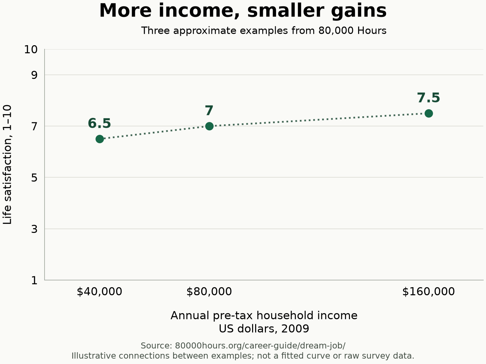

import QuranVerse from '@/components/QuranVerse.astro';
import HadithQuote from '@/components/HadithQuote.astro';

If you're a young Muslim, especially if you come from an Arab family, I really encourage you to read the 80,000 Hours career guide before you choose your college major.

The name comes from a simple estimate: 40 hours a week, 50 weeks a year, for 40 years. That's about 80,000 hours spent working. If you're going to give that much of your life to a career, spending a few hours thinking carefully about your choice makes sense. The [career guide is free to read online](https://80000hours.org/career-guide/).

I've noticed pressure to become a doctor, lawyer, or engineer among friends, in my surroundings, and in my own family. All my friends want to be doctors. In Arab families, it's common to hear the advice to become a doctor because it means good money and a comfortable life. This isn't every family, and I'm sure other cultures experience it too. But it's familiar enough that I want young people in our community to think about it early.

It's hard to question a path when your friends are choosing it and your family respects it. Still, medicine is a job with daily tasks and responsibilities. The promise of an easy life doesn't tell you whether you care about that work or want to learn to do it well.

There's nothing wrong with those careers. If you enjoy the work, can become good at it, and it fits the life you want, go for it. That includes the income you need and the hours you're willing to work. My concern is choosing a career mainly because other people respect the title.

## Find out what the work is actually like

A family can want the best for you and still push you towards something that doesn't suit you. They didn't intend to set you up for disappointment. But good intentions don't answer the questions you need to ask before committing years of your life.

You can spend years studying, studying, studying, possibly taking on student debt, without much experience of the work you're preparing to do. Then you finally get there and think, "Maybe this isn't what I wanted."

That's why I want young people to investigate before choosing a major. Talk to people who do the work. Ask about an ordinary working day, including the parts they dislike. Where possible, shadow someone, try an internship, or do a small project related to the field. You don't need your whole life figured out. You need more to go on than a title and an imagined salary.

## What makes a job worth doing?

The guide's [chapter on a dream job](https://80000hours.org/career-guide/dream-job/) points to five things: engaging tasks, helping others, work you can become good at, supportive colleagues, and avoiding serious drawbacks such as unfair pay or hours that clash with your personal life.

It also discusses finding a level of challenge you can handle, with enough support to grow. A job being easy isn't enough to make it fulfilling.

That gives you more useful questions to ask about a career. Would I enjoy the daily tasks? Could I develop the skills? Would the schedule work for me? Who would I be helping?

Money belongs in that conversation. You need to cover your expenses and responsibilities. But I wouldn't base a career choice on the biggest salary alone.

The guide gives a useful example of diminishing returns. In the US survey it discusses, households earning $40,000 before tax reported life satisfaction of about 6.5 out of 10. At $80,000, the figure was about 7. Reaching roughly 7.5 was associated with another doubling of income to $160,000. That's a much bigger income for a modest difference in how people rated their lives. See the guide's [discussion of money and life satisfaction](https://80000hours.org/career-guide/dream-job/#dont-chase-the-money).

That's an approximately logarithmic relationship: each doubling of income is associated with a similar increase in life satisfaction, so each extra dollar brings a smaller gain. These are historical US household figures in 2009 dollars, not a current salary target or a guarantee about what a pay rise will do for you. But they give you a reason to look carefully at what you're giving up for higher pay.

Historical US household income in 2009 dollars. Approximate examples from the [80,000 Hours career guide](https://80000hours.org/career-guide/dream-job/#dont-chase-the-money), not a current salary target or a prediction of an individual's happiness.

For me, the practical question is whether the extra pay is worth what a particular job asks of you.

## How I connect this to Islam

As a Muslim, I want seeking Allah's pleasure to come first in how I think about my career. The Quran describes life and death as a test of who does best in their deeds.

<QuranVerse verse="67:2" />

This reminds me to think about what I'm doing with the years I have.

Intention matters here. The Prophet ﷺ taught:

<HadithQuote hadith="bukhari-1" />

For me, that means asking why I want a particular career and what I intend to do with what I earn.

If you're good at a high-paying job, care about the work, and it fits your lifestyle, there's no problem with wanting that opportunity. You might want to support your family and have more to give.

<HadithQuote hadith="bukhari-1427-1428" />

In the same narration, the Prophet ﷺ also instructs people to begin with their dependents.

I also want to take the work itself seriously.

<HadithQuote hadith="bayhaqi-4929" />

Al-Albani graded this narration hasan, although [al-Busiri judged its chain weak](https://dorar.net/h/LEdjpu4R?osoul=1). I take it as encouragement to work with care and develop my ability. A respected title wouldn't be enough for me if I didn't want to do the actual work well.

And helping people isn't limited to one profession or to giving money.

<HadithQuote hadith="bukhari-6021" />

That gives me a reason to look broadly at where I can be useful.

This is the connection I see with 80,000 Hours. Its advice asks us to think about how our work can benefit others. I approach that question with the intention of pleasing Allah, subhanahu wa ta'ala.

## You can give without changing careers

The guide also explains how you can [help others without changing jobs](https://80000hours.org/career-guide/how-anyone-can-have-an-impact/), including by giving to effective charities. It points readers towards GiveWell, which evaluates charitable programs using research and evidence about their results. Its [recommended programs](https://www.givewell.org/charities/top-charities) include malaria prevention through medication and mosquito nets. GiveWell publishes its evidence and estimates of cost-effectiveness, so you can investigate what your donation could achieve.

I find that useful even for someone who already has a career. You can care about the work you do and think carefully about where your charity goes.

The Quran gives this example of spending in Allah's cause:

<QuranVerse verse="2:261" />

That is an encouragement to seek His reward through giving.

Wanting good in this life can sit alongside wanting good in the Hereafter. The Quran includes the prayer for both:

<QuranVerse verse="2:201" />

My hope is that young Muslims will bring that intention to their choices early, ask Allah for guidance, and take the time to learn about the work they are considering.

## Give this decision a few hours

Start with the [free online guide](https://80000hours.org/career-guide/), especially the chapter on what makes a fulfilling job. If you prefer a physical copy, you can buy the <a href="https://amzn.to/4A7XnBB" rel="sponsored">paperback on Amazon through my affiliate link</a>. As an Amazon Associate, I earn from qualifying purchases.

You can begin in a few minutes, but set aside a couple of hours for the guide rather than expecting to finish it in one short sitting.

If you haven't chosen your major yet, this is a good time to read it. Before committing years to preparing for a career, spend a little time finding out whether it's work you want to do and how you hope to benefit people through it.

## How I wrote this article

I dictated my thoughts using speech-to-text. AI helped me clarify them through follow-up questions, organize the structure, edit the wording, and format the article. It also helped check references and create the chart from the guide's figures. I reviewed and revised the draft throughout the process. The personal experiences, opinions, and recommendation to read the guide are mine.

## Resources

### Career guidance and giving

- [80,000 Hours career guide](https://80000hours.org/career-guide/), free to read online.
- [What makes for a dream job?](https://80000hours.org/career-guide/dream-job/), including the income and life-satisfaction discussion used for the chart.
- [How anyone can have an impact](https://80000hours.org/career-guide/how-anyone-can-have-an-impact/), including giving without changing careers.
- [GiveWell's recommended charities](https://www.givewell.org/charities/top-charities), with research on malaria prevention and other programs.
- <a href="https://amzn.to/4A7XnBB" rel="sponsored">80,000 Hours paperback on Amazon</a>, an affiliate link. As an Amazon Associate, I earn from qualifying purchases.

### Quran passages

The Quran quotations in this article use M. A. S. Abdel Haleem's English translation.

- [Surah Al-Mulk, 67:2](https://quran.com/67/2), life and death as a test of deeds.
- [Surah Al-Baqarah, 2:261](https://quran.com/2/261), spending in Allah's cause and multiplied reward.
- [Surah Al-Baqarah, 2:201](https://quran.com/2/201), asking for good in this world and the Hereafter.

### Hadith sources

- [Sahih al-Bukhari 1](https://sunnah.com/bukhari/1/1), deeds and intentions.
- [Sahih al-Bukhari 1427, 1428](https://sunnah.com/bukhari/24/31), the giving hand and providing for dependents.
- [Shu'ab al-Iman 4929](https://dorar.net/h/UtSlZmEN?osoul=1), doing work well. Al-Albani graded it hasan; [al-Busiri judged its chain weak](https://dorar.net/h/LEdjpu4R?osoul=1).
- [Sahih al-Bukhari 6021](https://sunnah.com/bukhari:6021), good deeds as charity.
